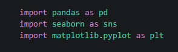
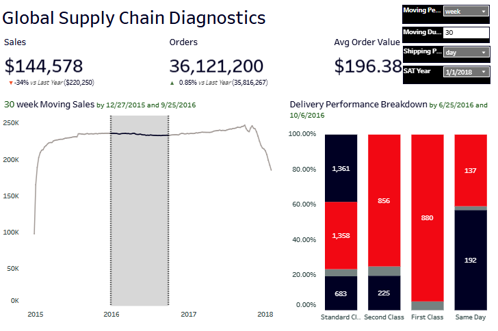

# Global Supply Chain Diagnostic Analysis

## Overview

This project provides an end-to-end diagnostic and predictive analysis of global supply chain operations based on enterprise order and shipping data from **DataSupplyCo**. The primary objective is to identify logistics operational bottlenecks, quantify shipping delays across regions and shipping modes, and establish data-driven strategies to improve order fulfillments and customer satisfaction.

Through automated data cleaning workflows, exploratory statistical modeling, and interactive Tableau dashboards, this project highlights key delivery risk factors and presents actionable recommendations for supply chain optimization.

---

## Technology Used

* **Data Processing & Automation:** Python (`Pandas`, `NumPy`)
* **Statistical Modeling & ML:** Python (`Scikit-Learn`, `SciPy`, `Statsmodels`)
* **Data Visualization & Business Intelligence:** Tableau Desktop / Public, `Matplotlib`, `Seaborn`
* **Database & Storage:** MySQL / CSV Data Lakes

Python Script Preview

---

## Project Workflows

### 1. Data Ingestion & Automated Cleaning Workflow
* **Ingestion:** Raw operational data loaded from global enterprise order databases.
* **Cleaning & Transformation:** Python automated pipeline to handle missing values, correct data types, standardise geographic location tags, and derive critical calculated fields (e.g., `Scheduled Shipping Days`, `Actual Shipping Days`, `Late Delivery Risk Index`).

### 2. Diagnostic & Exploratory Analysis
* **Mode & Region Profiling:** Evaluated order fulfillment times across Standard Class, Second Class, First Class, and Same Day shipping across global customer segments.
* **Bottleneck Identification:** Pinpointed high-variance regional hubs and order volume spikes causing delayed fulfillments.

### 3. Predictive Modeling & Tableau Dashboarding
* Built predictive risk models to anticipate shipping delays before orders leave the distribution center.
* Developed an interactive **Tableau Supply Chain Performance Dashboard** for real-time monitoring of delivery performance, shipping cost allocations, and fulfillment SLAs.

Supply Chain Performance Dashboard

---

## Key Insights

1. **High Late Delivery Risk Rate:** A significant percentage of shipments exhibit delays relative to scheduled delivery windows, primarily driven by standard class bulk shipments during peak demand cycles.
2. **Shipping Mode Disparities:** First Class and Same Day shipments maintain higher SLA compliance, whereas Standard Shipping faces high variance in cross-border fulfillment hubs.
3. **Regional Bottlenecks:** Specific global fulfillment hubs experience recurring operational backlogs, leading to cascaded delivery delays across neighboring destination zones.
4. **Order Volume Spikes:** Seasonality and unforecasted demand surges strongly correlate with increased shipping error rates and delayed dispatch times.

---

## Supply Chain Presentation

[View Global Supply Chain Presentation(PDF)](Images/Global%20Supply%20Chain%20Presentation.pdf)

---

## Strategic Recommendations

* **Optimize Carrier Allocation:** Dynamic rerouting of orders away from high-friction shipping hubs during peak operational windows.
* **Automate Risk Detection:** Implement the machine learning late-delivery prediction model into daily dispatch workflows to proactively notify regional logistics teams.
* **Buffer Stocking & Regional Hub Warehousing:** Reallocate high-demand inventory closer to high-volume regional fulfillment centers to reduce transit times for standard shipping modes.
* **SLA Restructuring:** Re-evaluate and align realistic scheduled delivery days for long-haul shipping routes to reduce customer friction and lower reported delay metrics.
